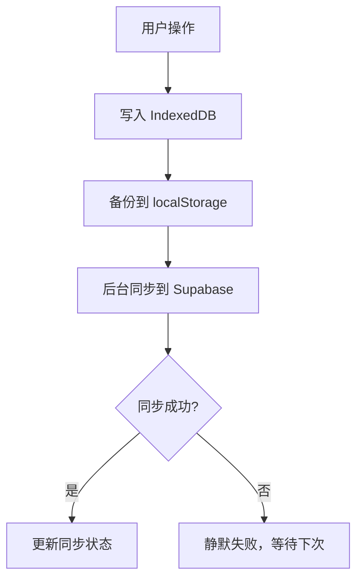

# 💰 Ledger - Personal Finance Tracker V2.0

一个优雅、现代的记账应用，支持**本地优先 + 云端备份**架构。


---

## ✨ 核心特性

### 📱 完全离线工作
- 无需网络也能正常记账
- 所有数据优先存储在本地（IndexedDB + localStorage）
- 即使云端不可用，应用仍可完整运行

### ☁️ 智能云端同步
- 自动备份数据到 Supabase
- 支持跨设备无缝同步
- 后台静默同步，不打断用户操作

### 🔒 数据安全保障
- Row Level Security (RLS) 用户数据隔离
- HTTPS 加密传输
- 本地 + 云端双重备份

### 🗄️ 智能存储管理
- **本地**：永久保留所有数据
- **云端**：仅保留最近 365 天数据
- 自动清理过期数据，节省云端空间

### 💱 多币种支持
- 支持 TWD、USD、SGD 等多种货币
- 自动汇率转换
- 跨币种预算计算

### 🎨 精美 UI 设计
- 实验室风格的预算可视化
- 流畅的烧瓶液体动画
- 多种主题切换
- 响应式设计，适配各种屏幕

---

## 🚀 快速开始

### 方式 1：仅本地使用（最简单）

```bash
# 直接打开 index.html 即可使用
open index.html
```

**无需任何配置，立即开始记账！**

### 方式 2：启用云端同步（推荐）

#### 步骤 1：创建 Supabase 项目
1. 访问 [supabase.com](https://supabase.com) 并注册
2. 创建新项目
3. 在 SQL Editor 中执行 `supabase-schema.sql`

#### 步骤 2：配置应用
在 `index.html` 中找到并替换：

```javascript
const SUPABASE_CONFIG = {
    url: 'https://your-project.supabase.co',
    anonKey: 'your-anon-key'
};
```

#### 步骤 3：开始使用
打开应用，点击「立即同步到云端」按钮来同步数据！

📖 **详细教程**：查看 [QUICK_START.md](./QUICK_START.md) 和 [SUPABASE_SETUP.md](./SUPABASE_SETUP.md)

---

## 📂 文件结构

```
ledger-app/
├── index.html              # 主应用文件（包含 HTML、CSS、JavaScript）
├── supabase-schema.sql     # Supabase 数据库架构
├── README.md               # 项目说明（本文件）
├── QUICK_START.md          # 快速开始指南
└── SUPABASE_SETUP.md       # Supabase 详细设置教程
```

---

## 🏗️ 技术架构

### 前端技术栈
- **核心**：Vanilla JavaScript (ES6+)
- **样式**：Tailwind CSS
- **图表**：Chart.js + chartjs-plugin-datalabels
- **图标**：Lucide Icons

### 本地存储
- **主存储**：IndexedDB（结构化数据库）
- **备份**：localStorage（降级方案）
- **数据模型**：
  - `transactions` - 交易记录
  - `categories` - 分类
  - `settings` - 用户设置
  - `sync_metadata` - 同步元数据

### 云端服务
- **数据库**：Supabase (PostgreSQL)
- **认证**：Supabase Auth
- **API**：RESTful API（自动生成）
- **实时同步**：支持（可选）

### 存储策略



---

## 📊 数据同步机制

### 同步策略
- **本地优先（Offline First）**：所有操作优先写入本地
- **异步同步**：后台上传，不阻塞用户界面
- **冲突解决**：本地数据优先（基于 `updated_at` 时间戳）

### 手动同步模式
应用采用**手动同步模式**，只有在用户点击「立即同步到云端」按钮时才会同步：
- ✅ 用户手动点击「立即同步到云端」按钮
- ✅ 新增/修改/删除交易后
- ✅ 修改预算或设置后
- ✅ 网络恢复时
- ✅ 用户手动触发

### 数据过期策略
- **云端**：自动删除 365 天前的数据（每次同步时执行）
- **本地**：永久保留所有数据
- **跨设备**：新设备仅拉取最近 365 天数据

---

## 🎯 功能列表

### ✅ 已实现
- [x] 交易记录管理（新增、修改、删除）
- [x] 多币种支持（TWD、USD、SGD）
- [x] 自动汇率转换
- [x] 预算管理
- [x] 分类管理（含 205+ Emoji 选项）
- [x] 数据可视化（饼图、柱状图）
- [x] 多主题切换
- [x] 历史记录查询
- [x] 月度统计
- [x] 本地优先存储（IndexedDB）
- [x] 云端手动同步（Supabase）- 点击「立即同步到云端」按钮
- [x] 数据自动过期（365 天）
- [x] 离线模式支持
- [x] 同步状态显示
- [x] 错误处理
- [x] 数据迁移（localStorage → IndexedDB）

### 🔮 未来计划
- [ ] 用户认证 UI（登录/注册页面）
- [ ] 数据导出（CSV/JSON）
- [ ] 数据导入
- [ ] 预算提醒
- [ ] 周期性交易（订阅、月租等）
- [ ] 多标签/标记
- [ ] 搜索和过滤
- [ ] PWA 支持（安装到主屏幕）
- [ ] 推送通知
- [ ] 深色模式优化

---

## 🔧 开发指南

### 本地开发

```bash
# 启动本地服务器（避免 CORS 问题）
python3 -m http.server 8000

# 访问
open http://localhost:8000
```

### 调试技巧

```javascript
// 在浏览器控制台查看数据
console.log(state);                    // 查看当前状态
console.log(state.transactions);        // 查看所有交易
await localDB.getAll('transactions');   // 查看 IndexedDB 数据

// 手动触发同步
await syncManager.syncToCloud();        // 上传到云端
await syncManager.syncFromCloud();      // 从云端拉取

// 查看同步状态
console.log(syncManager.lastSyncTime);
console.log(syncManager.isSyncing);
console.log(syncManager.syncError);
```

### 数据库管理

```sql
-- 在 Supabase SQL Editor 中执行

-- 查看用户的所有交易
SELECT * FROM transactions WHERE user_id = 'user-uuid-here';

-- 查看同步状态
SELECT * FROM user_settings WHERE user_id = 'user-uuid-here';

-- 手动清理过期数据
SELECT cleanup_old_transactions('user-uuid-here');

-- 查看数据统计
SELECT 
    COUNT(*) as total_transactions,
    SUM(amount) as total_amount,
    MIN(date) as earliest_date,
    MAX(date) as latest_date
FROM transactions 
WHERE user_id = 'user-uuid-here';
```

---

## 🐛 故障排查

### 问题：同步失败

**检查清单：**
1. ✅ 网络连接正常
2. ✅ Supabase 配置正确
3. ✅ 数据库 Schema 已执行
4. ✅ RLS 策略已启用
5. ✅ 用户已登录（如果需要）

**解决方案：**
```javascript
// 打开控制台，查看详细错误
// 检查 SUPABASE_CONFIG 是否正确
console.log(SUPABASE_CONFIG);

// 测试连接
const { data, error } = await supabase
    .from('transactions')
    .select('count');
console.log('Connection test:', { data, error });
```

### 问题：数据未显示

**可能原因：**
- IndexedDB 初始化失败
- 浏览器隐私模式
- 存储空间已满

**解决方案：**
1. 退出隐私/无痕模式
2. 清理浏览器缓存
3. 刷新页面
4. 查看控制台错误

### 问题：云端空间已满

**症状：** 设置页面显示「云端空间已满」

**解决方案：**
- 免费版限制 500MB（约可存储 10 万笔记录）
- 升级到 Supabase Pro
- 或手动清理旧数据

---

## 🔒 安全性

### 数据隔离
- 每个用户的数据通过 RLS 完全隔离
- 用户只能访问自己的数据
- 防止跨用户数据泄露

### 传输安全
- 所有通信使用 HTTPS
- API 密钥仅用于客户端操作
- 敏感操作需要用户认证

### 本地安全
- IndexedDB 存储在浏览器沙箱中
- 仅应用本身可访问
- 清除浏览器数据会同时清除本地存储

### 隐私保护
- ✅ 不收集任何分析数据
- ✅ 不追踪用户行为
- ✅ 代码完全开源
- ✅ 可自托管

---

## 📊 性能指标

### 应用大小
- **HTML/CSS/JS**：~60KB (未压缩)
- **依赖库**：通过 CDN 加载
- **总下载量**：~500KB (首次加载)

### 存储容量
- **本地 IndexedDB**：50MB+ (浏览器限制)
- **localStorage 备份**：5-10MB (浏览器限制)
- **云端 Supabase**：500MB (免费版)

### 性能表现
- **首次加载**：< 1 秒
- **添加交易**：< 100ms
- **渲染图表**：< 200ms
- **同步延迟**：< 500ms (取决于网络)

---

## 🤝 贡献指南

欢迎贡献代码、报告 Bug 或提出建议！

### 报告问题
1. 前往 [GitHub Issues](https://github.com/your-repo/issues)
2. 提供详细的错误信息和复现步骤
3. 附上浏览器控制台的错误日志

### 提交代码
1. Fork 本项目
2. 创建功能分支 (`git checkout -b feature/AmazingFeature`)
3. 提交更改 (`git commit -m 'Add some AmazingFeature'`)
4. 推送到分支 (`git push origin feature/AmazingFeature`)
5. 开启 Pull Request

---

## 📜 许可证

MIT License - 详见 [LICENSE](LICENSE) 文件

---

## 📞 联系方式

- **作者**：Owen
- **项目**：Ledger Personal Finance Tracker
- **版本**：V2.0
- **更新**：2026-01-13

---

## 🙏 致谢

感谢以下开源项目和服务：

- [Supabase](https://supabase.com) - 开源 Firebase 替代方案
- [Tailwind CSS](https://tailwindcss.com) - 实用至上的 CSS 框架
- [Chart.js](https://chartjs.org) - 简洁而灵活的图表库
- [Lucide Icons](https://lucide.dev) - 精美的开源图标
- [IndexedDB API](https://developer.mozilla.org/en-US/docs/Web/API/IndexedDB_API) - 浏览器端数据库

---

## 🎉 更新日志

### V2.0 (2026-01-13)
- ✨ **重大更新**：实现本地优先 + 云端备份架构
- ✨ 添加 IndexedDB 本地存储
- ✨ 集成 Supabase 云端同步
- ✨ 实现 365 天数据自动过期策略
- ✨ 添加同步状态 UI 和错误处理
- ✨ 支持完全离线工作
- 🎨 优化同步体验和用户反馈
- 🔒 增强数据安全和隐私保护
- 📖 完善文档和使用指南

### V1.x
- 基础记账功能
- 多币种支持
- 主题切换
- 数据可视化
- localStorage 存储

---

**Made with ❤️ by Owen | Designed for Beautiful Budgeting**

🎯 **现在就开始记账，让理财变得优雅而简单！**
